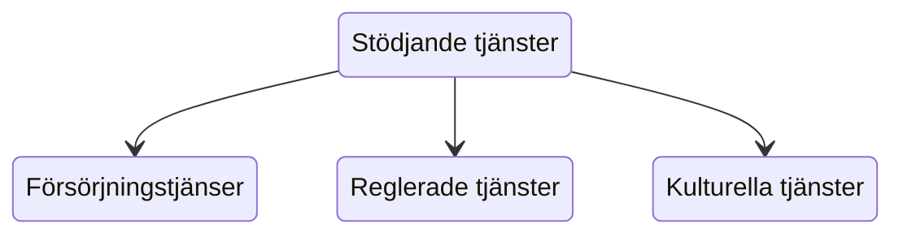

# Resurser och exploatering

För att djupdyka vidare i hållbar utveckling behöver vi utveckla terminologin runt resurser och exploatering.

:::info
s.7-17
:::

---

## Resurser och tillgångar

Jordens resurser kan delas in i olika 'sfärer'. Dessa är alla beroende av varandra och bygger upp den värld vi lever i.

- Biosfär
- Antroposfär (Teknosfär)
- Geosfär
- Atmosfär

:::warning
s.8-9
:::

---

## Exploatering

**Exploatera**: att utnyttja eller använda en resurs

:::info 
- Har det en negativ eller positiv ton?
- Kan ni komma på ett exempel där ordet används?
:::

---

Människan har sedan vi blev bofasta jordbrukare *exploaterat* jordens biologiska tillgångar.

*Jordbruk i de antika Egypten.*

---

Att utnyttja tillgångar är inte i sig negativt, och samtliga organismer i ett *ekosystem* utnyttjar biologiska tillgångar.

*Ekosystem* har en viss tålighet och är beroende av en konstant återväxt.

---

Idag är ungefär två tredjedelar av jordens ekosystem *överexploaterade*, det vill säga att utnyttjande överstiger återväxten.

---

*Mosaiksvansad råtta*

---

*Nordlig trubbnoshörning*

---

*Pungvarg*

---

*Spixara*

---

:::info
**Vad har alla arterna gemensamt?**
:::

---

Alla ovan arter är utdöda i det vilda, alla på grund av människan överexploatering av deras ekosystem. Både direkt eller indirekt.

---

*Munkhätta*

---

*Svart stork*

---

Arter kan också vara lokalt utdöda, som de två arterna ovan som inte längre finns i Sverige.

---

## Påverka exploatering

Hur stor exploatering av våra naturresureser är och hurvida den går över till överexploatering styrs av tre faktorer:

:::info
- Befolkningsstorlek
- Resursanvändning
- Effektivitet
:::

---

---

**Resursanvändning** återtar oss till: [Ekologisk fotavtryck](/bae5sHgPQiuw7iFKfgWDcg) och [Uppgift: Klimatkalkylatorn](/TCgRZ8ysSGCwY9b3e9W6iw).

Utöver att befolkningen ökar, ökar även våra behov.

---

Den tredje faktorn handlar om hur **effektivt** vi använder resurserna som existerar på jorden.

- Teknisk utveckling
- Kompetens
- Automatisering
- Arbetskraft

:::warning
Är effektivisering alltid positivt?
:::

---

## Ekosystemtjänster - resurser från biosfären

Att utnyttja resurser från *biosfären*, allt liv på jorden, kallas för *ekosystemtjänster*. Det syftar både till processerna och nyttjandet.

---

*Olika typer av ekosystemtjänster och hur de påverkar varandra*

---

**Stödjande tjänster**: syftar på indirekta tjänsterna som upprätthåller ekosystem. Exempelvis: fotosyntesen eller kvävecirkulation.

**Försörjningstjänster**: innebär det vi *försörjer* oss med. Exempelvis: mat, och material.

**Reglerade tjänster**: handlar om kapaciteten naturen har för att bryta ned avfall, rena vatten eller luft.

**Kulturella tjänster**: syftar till högre värden hos livet så som estetisk tilltalande vyer, eller möjlighet till rekreation.

---

## Resurser från geosfären

Utöver resurser från livet på jorden är vårt samhälle oerhört beroende av resureser från *geosfären*.

:::warning
- Vad krävs för att tillverka en mobiltelefon?
:::

---

:::info
- Energiförsörjning (kol, olja och naturgas)
- Mineral och metall
- Fosfor
:::

---

Återväxten i geosfären är betydligt långsammare än biosfären. Jämför *geologiska tidsåldrar* med *generationer* hos liv.

Flertalet av de resurser vi hämtar från geosfären har minskat drastiskt i tillgänglighet.

---

---

Ofta används begreppet **peak** (eng. "topp"). Ex. **peak oil** eller **peak phosphor**.

Begreppet syftar på när vi når produktionstopppen av en råvara, när den väl är nådd kommer produktion och tillgängligheten endast att minska.

---

*Simulering för peak oil i USAfrån 1956 (röd).
Faktiskt produktion i USA(grön.)*

---

