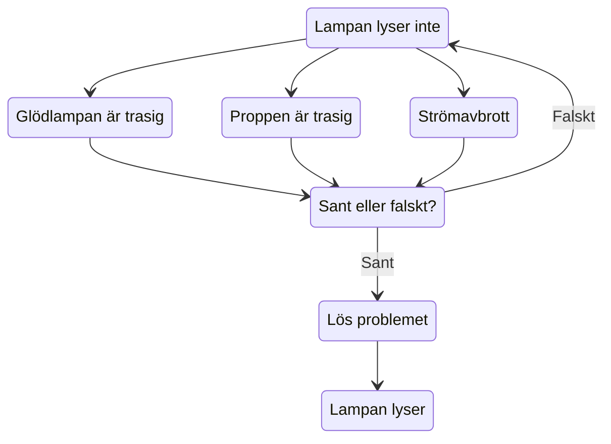
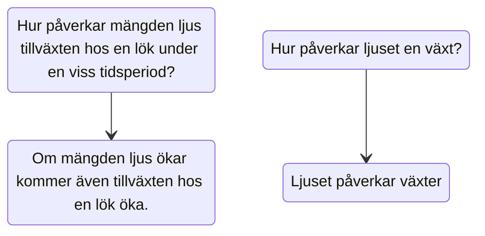

**Naturvetenskapligt arbetssätt**

> [!SUMMARY] Egen inläsning s.16-23

---

### Lampan lyser inte

---

### Typer av frågeställningar

En frågeställning kan vara **specifik** eller **ospecifik**.

> [!INFO] **Specifik** frågeställning beskriver både vad som förändras och vad som mäts.
> -  *Hur påverkar mängden ljus tillväxten hos en lök under en viss tidsperiod?*

>[!WARNING] **Ospecifik** anger varken vad som förändras eller vad som mäts
>- *Hur påverkar ljuset en växt?*

---

Beroende på hur frågeställningen är skriven leder det till olika hypoteser.

Vilken av frågeställningarna leder till en **prövbar** hypotes?

---

### Utföra experiment

För att säkerhetställa att just faktorn i hypotesen är anledning till en förändring behöver övriga faktorer uteslutas.

Övriga faktorer måste då hållas *konstanta* och kallas då de **kontrollerade variablerna**.

---

![[lokexp.png]]

>[!FAQ] Vad mer kan påverka lökens tillväxt och måste hållas konstant?

---

Det finns även **individuella variationer** mellan olika exemplar. Det är därför viktigt att också ha flera deltagare i varje **försöksgrupp**.

Vi kan även motverka **slumpen** genom att utföra ett experiment flera gånger.

---

### Placebo och kontrollgrupp

Ibland används även en **kontrollgrupp** vid experiment eller undersökningar. Detta för att utesluta slumpen eller individuell variation.

>[!INFO] En **kontrollgrupp** får inte behandling/tillsats/faktor som undersöks.

---

Om det är en medicinsk studie används oftast en **blindstudie**. Det innebär att deltagarna inte vet om de är med i kontrollgruppen eller den undersökta gruppen.

---

Blindstudie utförs för att utesluta **placeboeffekten**.

>[!INFO] **Placebo**: en gynsamm effekt uppstår hos patienten på grund av förväntningar trots att behandlingen är verkningslös.

---

### Resultat och slutsats

Eftersom naturvetenskapliga undersökningar till stor del består av **datainsamling** redovisas det vanligen i tabeller eller diagram.

---

När resultat från flera grupper redovisas brukar **medelvärde** och **standardavvikelse** anges.

---

>[!TIP] **Medelvärde**
>$$  
>\ M(x)= \frac {x_1 + x_2 + ... + x_n}n\\
>$$

>[!TIP] **Standardavvikelse**:
> Ett mått på hur stor spridningen inom gruppen är

---

---

Efter att ha redovisat och granskat resultat försöker man dra en eller flera **slutsatser**.

Dessa försöker besvara frågeställningen eller ta ställning till hypotesen.

---

**Kausalitet och korrelation**

:::info
**Korrelation**: Samband mellan variabler
**Kausalititet**: Orsakssamband mellan variabler
:::

---

---

### Ordlista

- Frågeställning
    - Specifik
    - Ospecifik
- Hypotes
    - Prövbar
    - Icke-prövbar
- Faktor
- Variabel
- Konstant
- Kontrollerad variabel
- Individuell variation
- Försöksgrupp
- Slump
- Kontrollgrupp
- Blindstudie
- Placeboeffekt
- Medelvärde
- Standardavvikelse
- Slutsats
- Korrelation
- Kausalitet
