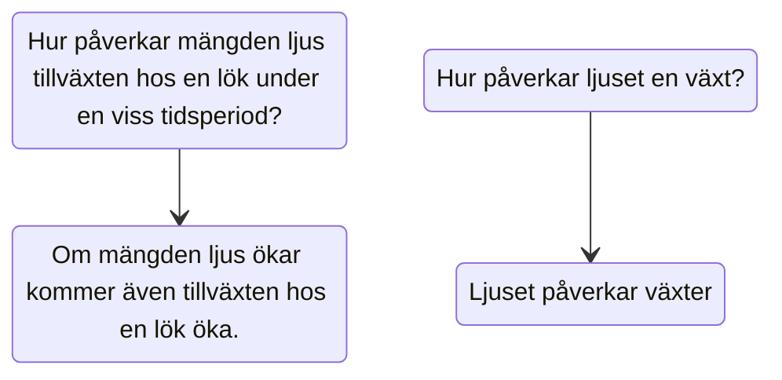

## Vad är naturvetenskap?
**Naturvetenskapligt arbetssätt**

:::info
Egen inläsning: s.7-15
:::

---

### En historisk bakgrund

- Antikens Grekland
    - Aristoteles
- Vetenskapliga revolutionen
    - 1500-1700-talet
    - Newton
- Modern definition
    - 1900-talet

---

### Vad är naturvetenskap?

- Förklara och beskriva hur vår omvärld är uppbyggd och fungerar
- Vetenskapliga modeller och systematiska undersökningar
- Teoretiska modeller

---

### Undersökningar

```flow
st=>start: Frågeställning
e=>end: Hypotes
op=>operation: Hypotes
op2=>operation: Sant eller falskt?
st->op->op2
```


---

:::info
**Frågeställning**: Formulerad som en fråga och anger syfte för undersökning.

*Blir resultaten i skolan bättre om man studerar mer?*
:::

:::warning
**Hypotes**: Formulerad som ett påstående och förutsäger resultatet av en händelse. Måste kunna vara sant eller falskt.

*Skolresultatet blir bättre om man studerar mer*
:::

---

- Undersökningar sker sedan genom **datainsamling** i form av *observationer, experiment,* eller *simuleringar*.
- Hypotesen måste vara *prövbar*
- Undersökningen måste vara *repeterbar*

---


---

### Naturvetenskapens begränsningar

En naturvetenskaplig hypotes måste vara *prövbar*.

:::danger
- Ge ett exempel på en icke-prövbar hypotes
:::

---

- Gud finns. / Gud finns inte.
- Det fler än ett universum. / Det finns bara ett universum.

---

Naturvetenskapen kan inte heller *värdera* innehåll eller svara på frågor gällande rätt och fel.

Exempelvis kan vi inte prata om huruvida en förändring är *bra* eller *dålig*, ex. klimatförändringar eller antibiotikaresistens. Vi kan endast förkasta eller bekräfta om förändringarna existerar eller ej.

---

### Observationer och simuleringar

Alla hypoteser kan inte studeras genom experiment. Då kan vi nyttja *observationer* eller *simuleringar* istället.

Vi kan däremot observera dem och samla in data genom dessa observationer.

---

**Klimatförändringar** studeras också genom observationer och simuleringar. Observationer så ser vi till det förgångna och simuleringar försöker vi förutse framtiden med hjälp av matematiska modeller.

---


*Graf visar observerade temperaturförändringar och simulerade temperaturförändringar.*

---

### Vetenskap och etik

För att bibehålla en systematisk och kvalitativ forskning existerar *vetenskapsråd* och *etiska kommittéer*.

- Förhindra fusk
- Kontrollera försök på djur och människor
- Etiskt försvarbara försök

---


:::danger
Vem är mannen? Vad har han med vetenskapsetik att göra?
:::

---

:::info
Egen läsning (s.12)
:::


---

:::info
Testa dig själv (s.14)
:::


